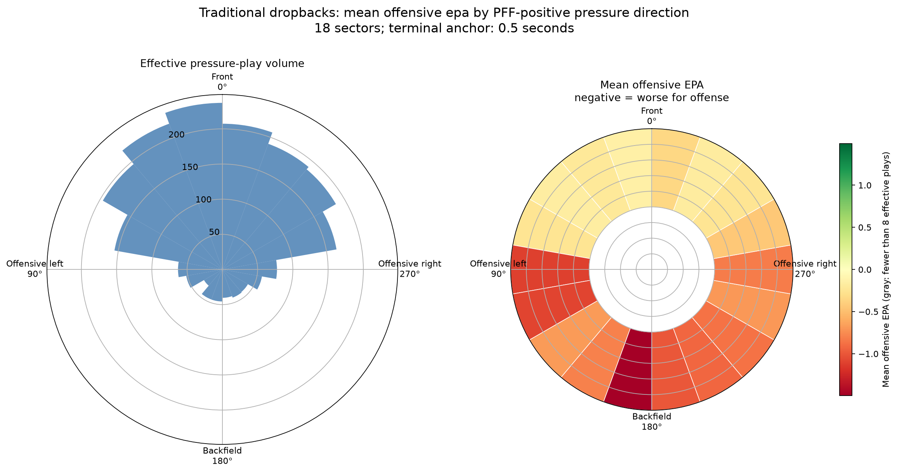
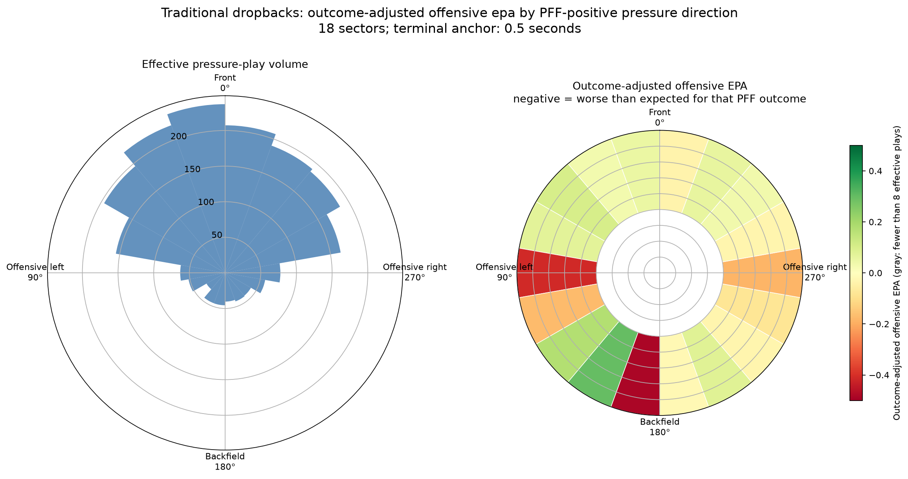
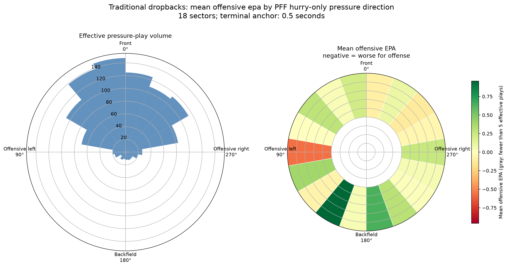

# NFL Pressure Geometry

An exploratory analysis of where quarterback pressure is located immediately
before a pass or sack, and whether that direction is associated with offensive
EPA. The goal is descriptive: make quarterback-relative pass-rush geometry
legible before trying to make causal claims about it.

## Question

Among plays already labeled by PFF as a hurry, hit, or sack, where is the
rusher relative to the quarterback shortly before the terminal event? Do some
directions correspond to worse offensive outcomes?

This preliminary project uses the first eight weeks of the 2021 NFL season
from the NFL Big Data Bowl 2023 tracking release. It is not a full-season or
league-wide estimate.

## Method in brief

* Keep PFF-positive pass rushers (`hurry`, `hit`, or `sack`) on conventional
  (`TRADITIONAL`) dropbacks; scrambles and rollouts are excluded.
* Locate each rusher relative to the quarterback **0.5 seconds before** the
  throw or sack event.
* Normalize field direction so the offense always attacks to the right.
  Angles are quarterback-relative: front = 0°, offensive left = 90°,
  backfield = 180°, and offensive right = 270°.
* Join nflverse play-by-play EPA. Plays with multiple PFF-positive rushers are
  split equally, so each play has total weight one.
* Use 18 angular bins and play-level bootstrap intervals for the exploratory
  EPA summaries.

## Preliminary findings

The directional distribution is meaningful and reasonably stable across
0.3-, 0.5-, and 0.7-second anchors: hurries and hits most often appear in
front of the quarterback, while sacks are more side/backfield distributed.

Raw directional EPA is more negative in several side and backfield bins, but
much of that pattern is explained by the fact that sacks are both more costly
and differently located. Once EPA is centered within each PFF outcome label,
there is no clear broad front/left/back/right effect in this sample.

The cleanest remaining lead is among **pure-hurry** plays—hurry plays without
a simultaneous PFF hit or sack. The 80°–100° bin, roughly offensive left,
averages -0.57 offensive EPA (95% bootstrap interval: -1.03 to -0.12; 20.3
play-equivalents). Because this scans 18 bins, it is a hypothesis for future
work rather than a firm directional finding.

### A blind-side hypothesis

That offensive-left signal is compatible with the familiar blind-side idea:
most quarterbacks throw right-handed, and pressure arriving from their left
may be less visible or harder to manage. The observed bin is roughly level
with the quarterback's offensive left rather than directly behind him, and
this project does not model quarterback handedness, vision, or awareness.
It should therefore be read as a useful hypothesis for a larger follow-up,
not evidence that blind-side pressure caused the poorer outcomes.

### Raw offensive EPA by pressure direction



Negative EPA (red) is worse for the offense. The left panel shows the
play-equivalent volume behind each sector.

### EPA after accounting for hurry, hit, or sack



Here, a value is compared with the typical EPA for its own PFF outcome. This
is the more relevant view when asking whether geometry adds information beyond
the pressure outcome itself.

### Pure-hurry directional EPA



This view excludes 296 hurry plays that also contain a PFF hit or sack,
leaving 1,049 pure-hurry plays.

## Reproduce

1. Place the Big Data Bowl 2023 files under the local path described in
   [data/README.md](data/README.md). Raw and derived data are intentionally
   ignored by Git.
2. Install the locked Python environment:

   ```powershell
   uv sync --all-groups
   ```

3. Run the checks and regenerate the published figures:

   ```powershell
   uv run pytest -q
   uv run ruff check src tests scripts
   uv run python scripts/run_season_epa_analysis.py
   ```

The analysis script downloads the 2021 nflverse play-by-play file as needed
to obtain EPA. The generated intermediate tables remain local in
`data/interim/`.

## Repository layout

```text
src/pressure_geometry/  Reusable loading, geometry, EPA, plotting, and summary code
scripts/                Reproducible season-sample analysis entry point
tests/                  Unit tests for core transformations
data/README.md          Local data layout and source notes
docs/methodology.md     Full method, validation, and caveats
figures/final/          Three documented result figures
```

## Limitations and next steps

PFF pressure labels are inputs, not predictions. The analysis is restricted
to one eight-week tracking sample, conditional on a PFF-positive rush event,
and does not control for down, distance, quarterback identity, protection,
or game state. The next study should expand the sample, test the left-side
hurry result out of sample, and add those play-context controls before making
any causal or tactical claim.
